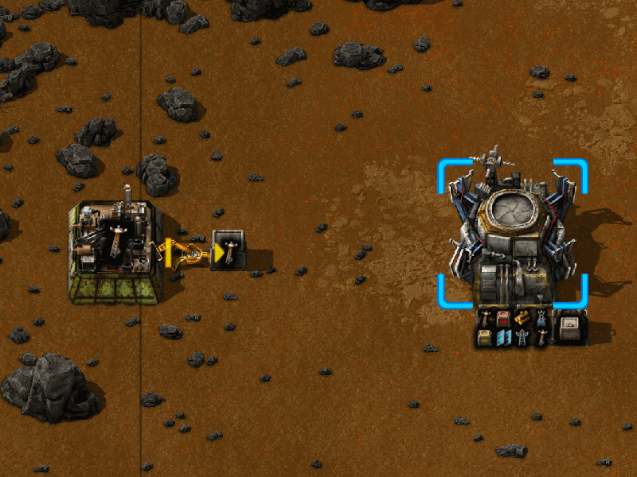

# HiTech's Quality of Life Improvements - For Factorio

This mod exists to make minor quality of life improvements to
[Factorio](https://www.factorio.com/) - that is, remove some minor
manual effort without affecting gameplay.

## Logistics Storage Container Upgrade

I like to create my production hubs anew each time, I don't usually work from a blueprint.
One point of frustration for me is when I reach the robot age, and it's time to update all my
iron (or steel) chests to storage containers.

Prior to this point, you will use the inventory bar to limit the production of items into storage;
you might want 50 radar dishes handy (one stack), not 2400 (48 stacks). 
This is especially important for items that are upcycled into other items, such as yellow transport belts
into red transport belts; as you tear up your base to upgrade your transport belts, you want the robots
to store the old belts where they can be upcycled, rather than building new belts entirely.

The manual upgrade process is:
- decide how many of the item you want to product (usually, one or two stacks)
- figure out how many items per stack
- use the circuit network to disable the inserter if the container already has that many
- upgrade the container to a logistics storage container
- view the container, set its filter to what the assembler produces, and remove the inventory limit bar

This mod simply automates this activity; you drop of logistics storage container chest over
an existing chest, and the mod will do the above steps for you, and provide a little feedback when it works.

Note: if the inserter has any red or green wire attachments, then the mod will _not_ introduce
a limit. It will still set the item filter on the container.

## On the implementation

My day job is coding [Clojure](http://clojure.org), and I prefer to use a Lisp for all my coding efforts.
Here, I've used [Fennel](https://fennel-lang.org/), a Lisp that transpiles into Lua,
and is modeled after Clojure. Like any Lisp,
Fennel lets me focus on the problem space, and write more concise and readable code.

